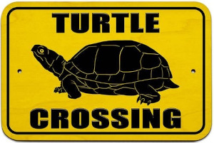
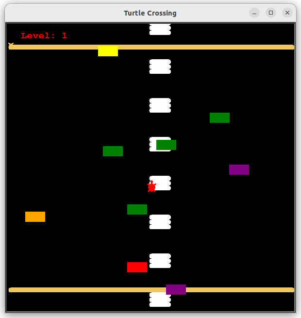
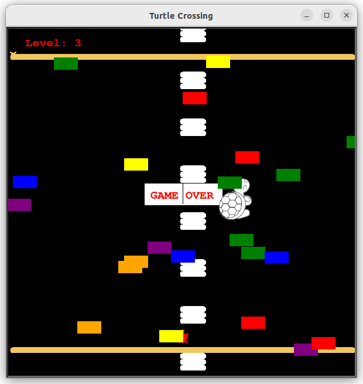

## Turtles Crossing

OOP Game written in Python using the turtle library.      
       
**Help Michelangelo turtle to cross the street.**



###### It's a part of the **#100DaysOfCode** challenge by *Angela Yu*. ######    


#### Prerequisites
You will need the following software to run the Turtles Crossing:
 - [Python 3](https://www.python.org/downloads/)

#### Installation
To get started with the **Turtles Crossing**, follow these steps:

1. **Clone** the repository:

```sh
git clone https://github.com/resole79/turtles_crossing.git
```

2. **Run** the **main.py** file:

```sh
python main.py
```

#### File Structure   
 - **main.py**: Main program.
 - **player.py**: Paddle class
	- *Method*: player_up, refresh_player
 - **car_manager.py**: CarManager class
	- *Instance*: list_of_car, speed_car
	- *Method*: create_car, increase_speed, move_car
 - **scoreboard.py**: Scoreboard class
	- *Instance*:level
	- *Method*:game_over, increase_level, refresh_score
 - **display.py**: MyScreen class
	- Instance*: list_of_window, this_window, x_coord, y_coord
	- *Method*: create_window, listen_player
 - **bord.py**: BordGame class
	- *Method*: create_bord

#### **Usage**

Press keys to move the turtles:	
 - "Up" to move up

 

       




## **Credit**

Author : Emilio Reforgiato (resole79)

##
<p align="right"><a href="https://www.linkedin.com/in/emilio-reforgiato/" target=”_blank” ></a></p>


